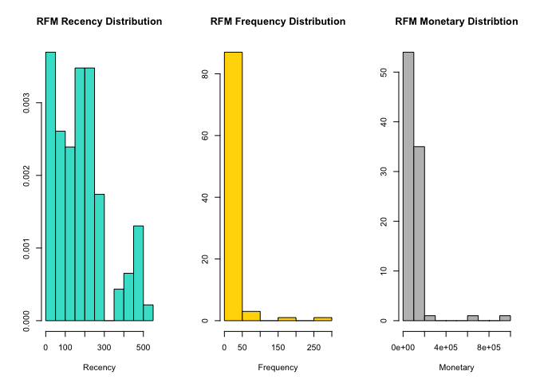
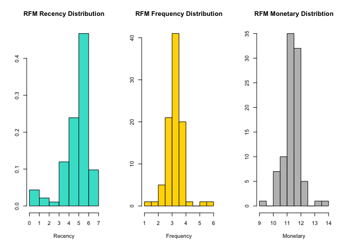
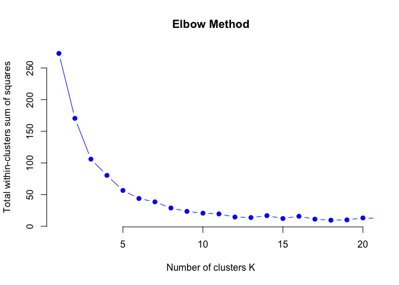
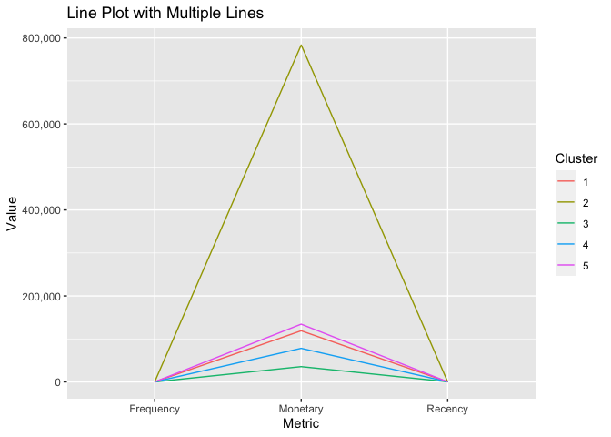
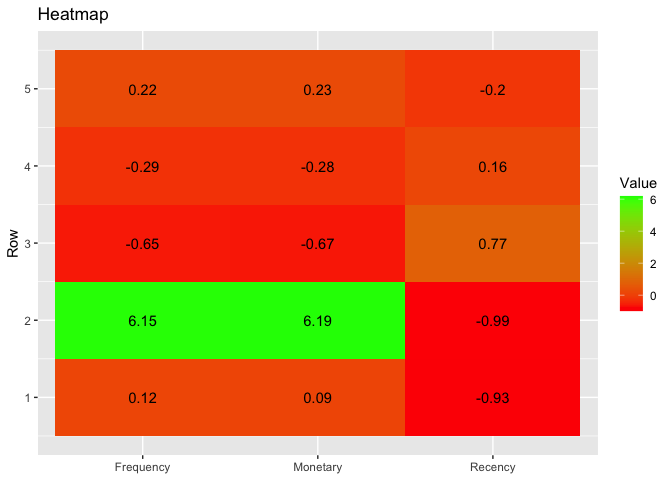

Customer Segmentation Analysis
================
Femi Ogungbade
8/25/2023

### Intro

Customer segmentation is a marketing strategy that involves dividing a
company’s customer base into distinct groups or segments based on
certain shared characteristics or behaviors. The goal of customer
segmentation is to better understand customers’ needs, preferences, and
behaviors in order to tailor marketing efforts, products, and services
to meet their specific requirements.

The kpi analysis and rfm segmentation has been done using sql and you
can find it in the repo under sales\_data\_analysis.sql

The inspiration for this post was post was gotten from this [kaggle
notebook](https://www.kaggle.com/code/alekhyabotta/customer-segmentation/notebook)
written in python.

### Load Library and Data.

1.  Start off loading the necessary libraries, mdsr is optional.
2.  The csv is available in the repo.

<!-- end list -->

``` r
library(tidyverse)
```

    ## ── Attaching packages ─────────────────────────────────────── tidyverse 1.3.2 ──
    ## ✔ ggplot2 3.4.0      ✔ purrr   1.0.1 
    ## ✔ tibble  3.1.8      ✔ dplyr   1.0.10
    ## ✔ tidyr   1.2.1      ✔ stringr 1.5.0 
    ## ✔ readr   2.1.3      ✔ forcats 0.5.2 
    ## ── Conflicts ────────────────────────────────────────── tidyverse_conflicts() ──
    ## ✖ dplyr::filter() masks stats::filter()
    ## ✖ dplyr::lag()    masks stats::lag()

``` r
# library(mdsr)
# load data from csv
rfm_table = read.csv("rfm_summary.csv")

# Increasing Recency values by 1 because we would log transform the data later
# this is to avoid getting any Inf values in the log transformed data
rfm_data = rfm_table %>% 
  mutate(Recency = Recency + 1) %>% 
  rename("Monetary" = "MonetaryValue") %>% 
  select(Recency, Frequency, Monetary)

rownames(rfm_data) = rfm_table[,1]
```

## Plot the distribution of the recency, fequency and monetary variables

``` r
par(mfrow = c(1, 3))  # Create a 1 row, 3 column layout


hist(rfm_data$Recency, ylab=NULL, xlab="Recency",probability = T, main = "RFM Recency Distribution", col="turquoise")


hist(rfm_data$Frequency, ylab=NULL,xlab="Frequency", main = "RFM Frequency Distribution", col="gold")

options(scipen = 999)
hist(rfm_data$Monetary, ylab=NULL,xlab="Monetary", main="RFM Monetary Distribtion", col="gray")
```

<!-- -->

``` r
options(scipen = 0)
par(mfrow = c(1, 1))  
```

## Removing the skewness by performing log transformation on the variables

From the plot above we can see the data is skewed rightward, moreso for
frequency and monetary values, the data is log transformed in order to
reduce the impact of extreme values and make the data more symmetric and
useful for analysis. The new plot shows the data normalised and
centered.
<!-- -->

## Standardizing the variables for equal variance and mean

Variables are standardized for several reasons in statistics.
Standardization involves transforming variables to have a specific mean
and standard deviation, often centered around 0 with a standard
deviation of 1.

``` r
rfm_normalised = rfm_log %>% mutate(across(everything(), scale)) 
summary(rfm_normalised)
```

    ##      Recency.V1         Frequency.V1         Monetary.V1    
    ##  Min.   :-3.491168   Min.   :-3.647722   Min.   :-3.797145  
    ##  1st Qu.:-0.242956   1st Qu.:-0.411793   1st Qu.:-0.391155  
    ##  Median : 0.369387   Median : 0.060791   Median :-0.040266  
    ##  Mean   : 0.000000   Mean   : 0.000000   Mean   : 0.000000  
    ##  3rd Qu.: 0.527095   3rd Qu.: 0.443401   3rd Qu.: 0.514259  
    ##  Max.   : 1.113146   Max.   : 4.008435   Max.   : 3.894981

## Choosing number of Clusters using Elbow Method

This article on
[r-bloggers](https://www.r-bloggers.com/2017/02/finding-optimal-number-of-clusters/)
consicely explains the problem of finding the number of clusters. The
optimal cluster is chose

``` r
set.seed(1231)
k_values = 1:21

inertia = sapply(k_values, function(k){kmeans(rfm_normalised,centers = k )$tot.withinss})

plot(k_values, inertia,
     type="b", pch = 19, frame = FALSE, 
     xlim=c(1,20),
     xlab="Number of clusters K",
     ylab="Total within-clusters sum of squares", 
     main="Elbow Method", col="blue")
```

<!-- -->

## Fit for 4 clusters

``` r
kmm.4 =  kmeans(rfm_normalised,4,nstart = 50,iter.max = 15)
cluster = kmm.4[["cluster"]]
rfm_4.cluster = cbind(rfm_data, cluster) %>% 
  group_by(cluster) %>% 
  summarise(Recency=mean(Recency), Frequency=mean(Frequency), Monetary=mean(Monetary))
(rfm_4.cluster)
```

    ## # A tibble: 4 × 4
    ##   cluster Recency Frequency Monetary
    ##     <int>   <dbl>     <dbl>    <dbl>
    ## 1       1    22.7      33.9  120444.
    ## 2       2   198.       29.1  103673.
    ## 3       3   280.       12.4   42569.
    ## 4       4     2       220.   783576.

## Fit for 5 clusters

While the 4 cluster segementation is simpler, 5 clusters provides more
insight, better separating monetary values on the low and high ends.

1.  Cluster 1: strong recency, moderate spenders
2.  Cluster 2,4: weak recency and low spending
3.  Cluster 3: moderate recency, moderate spending
4.  Cluster 5: strong recency, frequency and high spending

<!-- end list -->

``` r
kmm.5 =  kmeans(rfm_normalised,5,nstart = 50,iter.max = 15)
cluster = kmm.5[["cluster"]]
rfm_5.cluster = cbind(rfm_data, cluster) %>% 
  group_by(cluster) %>% 
  summarise(Recency=mean(Recency), Frequency=mean(Frequency), Monetary=mean(Monetary))
(rfm_5.cluster)
```

    ## # A tibble: 5 × 4
    ##   cluster Recency Frequency Monetary
    ##     <int>   <dbl>     <dbl>    <dbl>
    ## 1       1    13.4      34.2  118989.
    ## 2       2     2       220.   783576.
    ## 3       3   324.       10.7   35629.
    ## 4       4   212.       21.9   78171.
    ## 5       5   147.       37.5  134358.

## Snake Plot

``` r
snake_plot_df = rfm_5.cluster %>% 
  pivot_longer(cols = c(Recency, Frequency, Monetary), 
               names_to="Metric",
               values_to= "Value")

ggplot(snake_plot_df, aes(x = Metric, 
                      y = Value, 
                      group = cluster, 
                      color=as.factor(cluster))) +
  geom_line() +
  labs(x = "Metric", y = "Value", color = "Cluster") +
  ggtitle("Line Plot with Multiple Lines") + 
  scale_y_continuous(labels = scales::comma)
```

<!-- -->

## Finding the relative importance of each value

``` r
population_avg = rfm_data %>% summarise(across(everything(), mean)) 

relative_importance = rfm_5.cluster %>% 
  mutate(Recency = Recency/population_avg$Recency - 1,
         Frequency = Frequency/population_avg$Frequency - 1,
         Monetary = Monetary/population_avg$Monetary - 1)


ggplot(relative_importance %>% 
         pivot_longer(cols=2:4, names_to = "Variable", values_to="Value"), 
       aes(x = Variable, y = cluster, fill = Value)) +
  geom_tile() +
  scale_fill_gradient(low = "red", high = "green") +
  geom_text(aes(label = round(Value, 2)), color = "black") + 
  labs(title = "Heatmap", y = "Row", fill = "Value") + 
  theme(axis.title.x = element_blank())
```

<!-- -->
